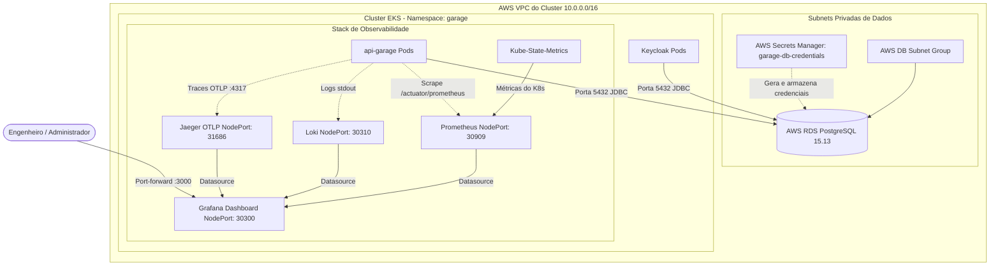

# 🐘 Banco de Dados RDS & Observabilidade (`15-soat-tech-challenge-iac-db`)

Repositório de **Infraestrutura como Código (IaC)** responsável pelo provisionamento do banco de dados relacional gerenciado **AWS RDS PostgreSQL** (com gerenciamento de segredos via **AWS Secrets Manager**) e implantação da stack completa de **Observabilidade e Telemetria** no Kubernetes.

---

## 🎯 1. Descrição do Propósito

Este repositório atende a dois pilares fundamentais da solução:
* **Persistência de Dados Confiável e Segura**: Criação de instância de banco de dados PostgreSQL na versão estável **15.13** totalmente isolada nas subnets privadas da VPC do EKS, com credenciais rotativas gerenciadas pelo AWS Secrets Manager e liberação de porta exclusiva (5432) para a rede interna.
* **Observabilidade e Monitoramento Centralizado**: Implantação e orquestração dos quatro pilares da observabilidade moderna dentro do cluster Kubernetes:
  * **Métricas de Cluster e Pods**: Coletadas pelo **Prometheus** e **Kube-State-Metrics**.
  * **Logs Agregados**: Ingestão e pesquisa de logs estruturados de contêiner via **Grafana Loki**.
  * **Rastreamento Distribuído (Distributed Tracing)**: Rastreamento fim a fim de transações HTTP via **Jaeger** com protocolo OpenTelemetry (OTLP).
  * **Visualização Unificada**: Dashboards pré-provisionados no **Grafana** com métricas de sistema, HPA, logs e traces integrados.

---

## 💻 2. Tecnologias Utilizadas

* **Infraestrutura como Código**: Terraform 1.6+ (com HCL e descoberta dinâmica via Data Sources).
* **Banco de Dados Gerenciado**: Amazon Relational Database Service (AWS RDS PostgreSQL 15.13, classe `db.t3.micro`, armazenamento 20 GB `gp2`).
* **Gerenciamento de Segredos**: AWS Secrets Manager (`garage-db-credentials`).
* **Rede & Segurança do Banco**: AWS DB Subnet Group privado e Security Groups restritos ao CIDR da VPC (`10.0.0.0/16`).
* **Métricas**: Prometheus v2 e Kube-State-Metrics v2.
* **Logs**: Grafana Loki.
* **Distributed Tracing**: Jaeger All-In-One com receptores OTLP (portas 4317 gRPC e 4318 HTTP).
* **Visualização**: Grafana com dashboards automáticos provisionados via ConfigMaps do Kubernetes.

---

## 🏛️ 3. Diagrama da Arquitetura do Repositório



---

## ⚙️ 4. Passos para Execução e Deploy

> [!CAUTION]
> **DIRETRIZ MANDATÓRIA DE DEVSECOPS: NUNCA MAPEAR DADOS SENSÍVEIS NO CÓDIGO FONTE**
> É **estritamente proibido** comitar senhas mestras de banco de dados (`db_password`), tokens ou credenciais da AWS em arquivos `.tf`, `.tfvars`, `.yaml` ou scripts.
> Todas as credenciais de banco de dados e chaves da AWS **devem ser configuradas exclusivamente nos Segredos da Pipeline (GitHub Actions Secrets)** e no **AWS Secrets Manager**, sendo injetadas de forma dinâmica e segura.

### 4.1. Pré-Requisito Obrigatório
> [!IMPORTANT]
> O **Passo 1 (`15-soat-tech-challenge-iac-k8s`)** deve estar aplicado. Este repositório descobre automaticamente a VPC `techchallenge-cluster-vpc` e o cluster Kubernetes em execução.


### 4.2. Comandos do Terraform
Com as credenciais ativas do AWS Learner Lab no terminal:

```bash
# 1. Inicializar providers
terraform init

# 2. Validar sintaxe
terraform validate

# 3. Planejar as alterações
terraform plan

# 4. Provisionar na AWS (leva cerca de 4 a 6 minutos para criação do RDS)
terraform apply -auto-approve
```

### 4.3. Como Acessar a Stack de Observabilidade Localmente
Como os serviços estão em subnets privadas do cluster, utilize o comando `port-forward` do `kubectl` para acessá-los no seu navegador:

```bash
# Acessar o Grafana (Login anônimo Admin pré-configurado)
kubectl -n garage port-forward svc/grafana 3000:3000
# Acesse no navegador: http://localhost:3000

# Acessar o Prometheus Web UI
kubectl -n garage port-forward svc/prometheus 9090:9090
# Acesse no navegador: http://localhost:9090

# Acessar a interface de Tracing do Jaeger
kubectl -n garage port-forward svc/jaeger 16686:16686
# Acesse no navegador: http://localhost:16686
```

---

## 📑 5. Link para o Swagger e Postman das APIs

As APIs que consomem este banco de dados e expõem métricas para o Prometheus estão mapeadas e documentadas nos seguintes endereços:

### 🌐 Endpoints de Métricas e Documentação:
* **Métricas da Aplicação para Prometheus**:
  ```
  https://igqc9vtfx9.execute-api.us-east-1.amazonaws.com/api/actuator/prometheus
  ```
* **Swagger UI (Consumo das APIs com persistência no RDS)**:
  ```
  https://igqc9vtfx9.execute-api.us-east-1.amazonaws.com/api/swagger-ui/index.html
  ```

### 📬 Exemplo de Requisição no Postman (Verificação de Saúde do Banco):

```bash
curl --location 'https://igqc9vtfx9.execute-api.us-east-1.amazonaws.com/api/actuator/health'
```

**Resposta esperada confirmando conexão com o RDS PostgreSQL**:
```json
{
  "status": "UP",
  "components": {
    "db": {
      "status": "UP",
      "details": {
        "database": "PostgreSQL",
        "validationQuery": "isValid()"
      }
    }
  }
}
```
